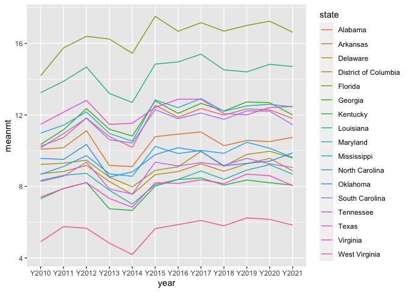
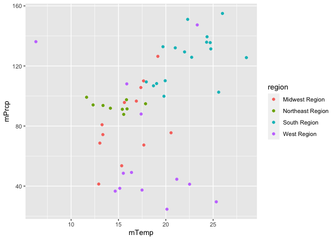

Geog4/6300: Lab 1
================

## Loading data into R, data transformation, and summary statistics

Your name: Nathan Castro

**Overview:**

This lab is intended to assess your ability to use R to load data and to
generate basic descriptive statistics. You’ll be using monthly weather
data from the Daymet climate database (<http://daymet.ornl.gov>) for all
counties in the United States over a 11 year period (2010-2021). These
data are available on the Github repo for our course. The following
variables are provided:

-   cty_txt: Code for joining to census data
-   year: Year of observation (with an initial “Y” to make it a
    character)
-   month: Month of observation (1=Jan, 2=Feb, etc.)
-   median_tmax: Median maximum recorded temperature (Celsius)
-   median_tmin: Median minimum recorded temperature (Celsius)
-   sum_prcp: Total recorded prcpitation for the month (mm)
-   cty_name: Name of the county
-   state: state of the county
-   region: Census region (map:
    <https://www2.census.gov/geo/pdfs/maps-data/maps/reference/us_regdiv.pdf>)
-   division: Census division
-   X: Longitude of the county centroid
-   Y: Latitude of the county centroid

These labs are meant to be done collaboratively, but your final
submission should demonstrate your own original thought (don’t just copy
your classmate’s work or turn in identical assignments). Your answers to
the lab questions should be typed in the provided RMarkdown template.
You’ll then “knit” this to an Github document and upload it to your
class Github repo.

**Procedure:**

Load the tidyverse package and import the data:

``` r
library(tidyverse)
daymet_data <- read_csv("data/daymet_monthly_median_2010-2021.csv")
```

We can look at the first few rows of the dataset using the *head*
function. We also use *kable* to format this nicely.

``` r
kable(head(daymet_data))
```

| cty_txt | year  | month | median_tmax | median_tmin | sum_prcp | cty_name          | state  | region      | division         |         x |        y |
|:--------|:------|------:|------------:|------------:|---------:|:------------------|:-------|:------------|:-----------------|----------:|---------:|
| G02060  | Y2010 |     1 |       -4.27 |      -10.83 |    10.04 | Bristol Bay       | Alaska | West Region | Pacific Division | -156.7011 | 58.74213 |
| G02185  | Y2010 |     1 |      -20.73 |      -28.20 |     0.00 | North Slope       | Alaska | West Region | Pacific Division | -153.4411 | 69.30696 |
| G02180  | Y2010 |     1 |      -16.50 |      -23.72 |     5.75 | Nome              | Alaska | West Region | Pacific Division | -163.9703 | 64.89492 |
| G02050  | Y2010 |     1 |      -11.20 |      -18.90 |    24.55 | Bethel            | Alaska | West Region | Pacific Division | -159.7678 | 60.92187 |
| G02261  | Y2010 |     1 |      -13.93 |      -20.03 |    15.84 | Valdez-Cordova    | Alaska | West Region | Pacific Division | -144.4573 | 61.57080 |
| G02170  | Y2010 |     1 |       -5.10 |      -12.42 |    35.84 | Matanuska-Susitna | Alaska | West Region | Pacific Division | -149.5702 | 62.31653 |

**Question 1:** After loading the file into R, pick TWO variables and
determine whether they are nominal, ordinal, interval, and ratio data
using the course readings and lectures as reference. Justify each
classification in a sentence or two.

{cty_name is a type of nominal data because a city name is unique and
made up of letters. Sum_prcp is a type of ratio data because it is a
number but the value could be 0.}

There are a lot of observations here, 452,448, to be exact. To get a
better grasp on it, we can use group_by and summarise in the tidyverse
package, which we covered in class. This will allow us to identify the
mean value for each year by county across the study period.

**Question 2:** Use group_by and summarise to calculate the mean minimum
temperature for each year *by county* across all months, also including
State and Region as grouping variables. Your resulting dataset should
show the value of tmin for each county in each year. Use the kable and
head functions as shown above to call the resulting table.

``` r
tmin_data <- daymet_data %>% 
  group_by(cty_txt, state, region, year) %>% 
  summarise(tmin_mean = mean(median_tmin))
```

    ## `summarise()` has grouped output by 'cty_txt', 'state', 'region'. You can
    ## override using the `.groups` argument.

``` r
kable(head(tmin_data))
```

| cty_txt | state   | region       | year  | tmin_mean |
|:--------|:--------|:-------------|:------|----------:|
| G01001  | Alabama | South Region | Y2010 |  10.66375 |
| G01001  | Alabama | South Region | Y2011 |  10.81333 |
| G01001  | Alabama | South Region | Y2012 |  12.19917 |
| G01001  | Alabama | South Region | Y2013 |  11.21500 |
| G01001  | Alabama | South Region | Y2014 |  10.76167 |
| G01001  | Alabama | South Region | Y2015 |  13.09750 |

**Question 3:** What if we were only interested in the South Region?
Filter the original data frame (daymet_data) to just include counties in
this region. Then calculate the mean minimum temperature by year *for
each state.* For an optional extra challenge, use the round function to
include only 1 decimal point. You can type ?round in the console to find
documentation on this function. Use kable and head to call the first few
lines of the resulting table

``` r
daymet_data_SR <- daymet_data %>% 
  filter(region =='South Region') %>% 
  group_by(state, year)%>%
  summarise(meanmt = mean(median_tmin))
```

    ## `summarise()` has grouped output by 'state'. You can override using the
    ## `.groups` argument.

``` r
  kable(head(daymet_data_SR))
```

| state   | year  |   meanmt |
|:--------|:------|---------:|
| Alabama | Y2010 | 10.24551 |
| Alabama | Y2011 | 10.73490 |
| Alabama | Y2012 | 11.83369 |
| Alabama | Y2013 | 10.79009 |
| Alabama | Y2014 | 10.18975 |
| Alabama | Y2015 | 12.54363 |

**Question 4:** To visualize the trends, we could use ggplot to
visualize change in mean temperature over time. Create a line plot
(geom_line) showing the state means you calculated in question 3. Use
the color parameter to show separate colors for each state. You may also
need to define the state as a group in the aesthetic parameter.

``` r
ggplot(daymet_data_SR, aes(x=year,y=meanmt,color=state,group=state))+
  geom_line()
```

<!-- -->

**Question 5:** If you wanted to look at these data as a table, you’d
need to have it in wide format. Use the pivot_wider function to create a
wide format version of the data frame you created in question 3. In this
case, the rows should be states, the columns should be the years, and
the data in those columns should be mean minimum temperatures. Then call
the *whole table* using kable.

``` r
wide_data <-daymet_data_SR %>% 
  pivot_wider(names_from = year, values_from = meanmt)
kable(wide_data)
```

| state                |     Y2010 |     Y2011 |     Y2012 |     Y2013 |     Y2014 |     Y2015 |     Y2016 |     Y2017 |     Y2018 |     Y2019 |     Y2020 |     Y2021 |
|:---------------------|----------:|----------:|----------:|----------:|----------:|----------:|----------:|----------:|----------:|----------:|----------:|----------:|
| Alabama              | 10.245510 | 10.734901 | 11.833694 | 10.790093 | 10.189751 | 12.543626 | 11.866754 | 12.359185 | 11.990535 | 12.341113 | 12.285535 | 11.803215 |
| Arkansas             | 10.079350 | 10.169006 | 11.119139 |  9.174078 |  9.112750 | 10.780661 | 10.927544 | 11.046489 | 10.279783 | 10.576967 | 10.509972 | 10.749478 |
| Delaware             |  8.710000 |  8.837778 |  9.178194 |  8.275417 |  7.555417 |  8.657917 |  8.832361 |  9.269167 |  8.847917 |  9.268194 |  9.571944 |  8.871806 |
| District of Columbia |  9.231250 |  9.299584 |  9.466667 |  8.518750 |  7.978333 |  8.896667 |  9.101250 |  9.960834 |  9.126250 |  9.791250 |  9.969583 |  9.590000 |
| Florida              | 14.193762 | 15.752463 | 16.399621 | 16.247929 | 15.448762 | 17.515896 | 16.680100 | 17.161580 | 16.688346 | 17.009061 | 17.245578 | 16.628458 |
| Georgia              | 10.347883 | 11.170511 | 12.355335 | 11.202432 | 10.818304 | 12.789607 | 12.087993 | 12.650435 | 12.221292 | 12.729167 | 12.686963 | 11.995301 |
| Kentucky             |  7.313726 |  7.892549 |  8.214351 |  6.749837 |  6.659774 |  8.019806 |  8.387410 |  8.477073 |  8.075319 |  8.359674 |  8.207757 |  8.075701 |
| Louisiana            | 13.248724 | 13.880033 | 14.680664 | 13.202969 | 12.699922 | 14.846419 | 14.964766 | 15.401602 | 14.524740 | 14.407923 | 14.834108 | 14.709909 |
| Maryland             |  8.334948 |  8.623281 |  8.734462 |  7.787986 |  7.008941 |  8.107795 |  8.392500 |  8.864080 |  8.396684 |  8.914427 |  9.219514 |  8.681406 |
| Mississippi          | 10.984035 | 11.431438 | 12.168389 | 10.967403 | 10.530401 | 12.839426 | 12.409924 | 12.919746 | 12.203547 | 12.507703 | 12.597368 | 12.446601 |
| North Carolina       |  8.675038 |  9.117442 |  9.727054 |  8.707479 |  8.566662 | 10.239342 |  9.841467 | 10.016312 |  9.853292 | 10.471858 | 10.136233 |  9.622996 |
| Oklahoma             |  9.568831 |  9.515498 | 10.350790 |  8.527890 |  8.813268 |  9.778474 | 10.167760 |  9.960471 |  9.157338 |  9.294513 |  9.413074 |  9.877798 |
| South Carolina       | 10.163052 | 10.959121 | 11.818397 | 10.616196 | 10.428043 | 12.299964 | 11.791630 | 12.105616 | 11.755770 | 12.227527 | 12.211504 | 11.453342 |
| Tennessee            |  8.279781 |  8.572684 |  9.359118 |  7.862009 |  7.575233 |  9.361088 |  9.147855 |  9.333417 |  9.175232 |  9.573070 |  9.262618 |  9.062390 |
| Texas                | 11.478857 | 12.157956 | 12.815773 | 11.474339 | 11.538154 | 12.421132 | 12.880901 | 12.882920 | 12.072930 | 12.009859 | 12.420048 | 12.474040 |
| Virginia             |  7.409715 |  7.880649 |  8.217077 |  7.327907 |  6.839179 |  8.209383 |  8.169474 |  8.376147 |  8.159727 |  8.686776 |  8.600852 |  8.050179 |
| West Virginia        |  4.910909 |  5.756598 |  5.662424 |  4.829826 |  4.189849 |  5.642818 |  5.866697 |  6.098197 |  5.799614 |  6.241008 |  6.157992 |  5.836871 |

**Question 6:** Let’s assess the relationship of heat and precipitation
by region. Returning to the original dataset, create a data frame that
shows the mean *maximum* temperature and mean precipitation for *all*
states in 2015, also including region as a subgroup. Then use ggplot to
create a scatterplot (geom_point) for these two variables, coloring the
points using the region variable.

``` r
heat_prcp <- daymet_data %>% 
  group_by(state, region) %>%
  filter(year == "Y2015") %>%
 summarise(mTemp = mean(median_tmax), mPrcp = mean(sum_prcp))
```

    ## `summarise()` has grouped output by 'state'. You can override using the
    ## `.groups` argument.

``` r
  ggplot(heat_prcp, aes(x=mTemp,y=mPrcp,color=region))+
  geom_point()
```

<!-- -->

**Question 7:** In the space below, explain what each function in your
code for question 6 does to the dataset in plain English.

{First i created a new data frame called heat_prcp that would pull data
from daymet_data. I then grouped_by state and region to isolate each
state with their corresponding region in the table. I also filtered the
dataset by year = 2015 since that is what we were asked to look at.
Afterwards i used the summarise function to find the mean values for max
temperature and precipitation. Using the summarise function also creates
the two new columns in the table. At the end i hadto visualize the data
with ggplot. I set the data frame as the new heat_prcp, set the x and y
axis to the new mean values i made and changed the color to region. I
used geom_point to make it a scatterplot.}

**Bonus question:** In script 1-3, we covered ways of working with the
Daymet API. Create a script below that uses that daymetr package to
download data from Daymet for a place (or places) of your choosing, uses
a dplyr function (e.g., mutate, summarise, filter, etc.) to wrangle the
data, and then visualizes it using ggplot. In addition to this code,
write a short summary of a pattern that’s evident in the data you
visualized.

``` r
#Your code goes here
```

{Explanation goes here.}

**Lab reflection:** How do you feel about the work you did on this lab?
Was it easy, moderate, or hard? What were the biggest things you learned
by completing it?

I found this lab to be moderate. I found I had the right idea of how to
do the tasks but ran into a handful of syntax errors that I had to look
up.
